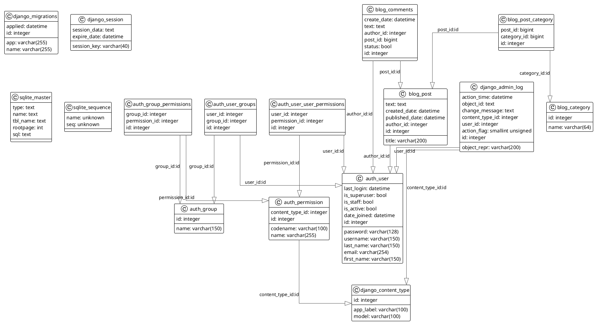

'''
Блог с категориями: Спотрсменки, Актрисы, Певицы.
Категории добавлять к постам через админку.
С регистрацией и авторизацией.
Добавление, удаление, редактирование постов.
Добавление комментариев.
Частично подключен bootstrap 4.
Написан на фреймворке Django.
Запуск: python3 manage.py runserver
'''
